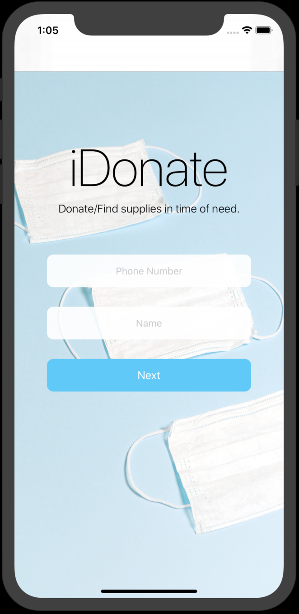

# iDonate

pennkey: pqy

## Description

In special circumstances, there are always a shortages of things: shortage of toilet papers, masks, hand sanitizers... And those who have extra and those who are in need. iDonate aims to help with the supply exchange process by allowing people to search donor/seekers within his/her area, so they could donate/ get supplies.

### Prerequisites

have xcode installed.

### Functionalities

To start, user need to enter their user name and phone number to log supplies into the database. The supplies that currently support are: toilet paper, mask, and syringe.

### Donate Supply

Users can donate supply by selecting the donor button on the second page. Next, enter the type of supplies and amount you want to donate. After confirmed, the user is redirected to a map where it shows all seekers represented with different pins, depending on what kind of supply they seek. Tap on the pin to see how many each seeker needs, and use the tel number on the label to contact them. After donating, click the donate button so the numbers are updated. 

### Seek Supply 

Similarly, users can seek supply by selecting the seeker button. One can also hit the back button above the map to update donor/seeker status and supply type and amount. Get donor's contact information by clicking on pins and when you successfully get the supply, hit the get button on the pin to update the amount after exchange.  

## Built With

* [XCode](https://developer.apple.com/xcode/) - app developer
* [Firebase](https://firebase.google.com/) - realtime database
* [Adobe Illustrator & Adobe XD](https://www.adobe.com/) - UI design

